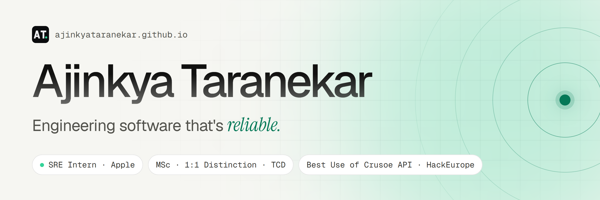

<a href="https://ajinkyataranekar.github.io">
  <picture>
    <source media="(prefers-color-scheme: dark)" srcset="assets/banner-dark.png">
    
  </picture>
</a>

  
  
  
  
  

### नमस्ते 🙏🏻 I'm Ajinkya

I'm a software & site reliability engineer in Dublin 🇮🇪. Most recently I was an **SRE Intern at Apple**; before that I spent 3+ years at **Nuclei** building digital-banking platforms in Go, Java and Svelte, and being on call for them. I hold an **MSc in Computer Science with a 1:1 Distinction** from Trinity College Dublin, where my dissertation taught small on-device language models to follow a written constitution.

- 🔭 I care about reliability and observability, distributed backends, and making GenAI trustworthy
- 🌱 Open to SRE, backend, platform and GenAI roles
- 📫 Easiest way to reach me: [ajinkyataranekar26@gmail.com](mailto:ajinkyataranekar26@gmail.com)

### 🧭 Selected work

<table>
  <tr>
    <td width="50%" valign="top">
      
       
      <b><a href="https://github.com/AjinkyaTaranekar/trustworthy-personalized-ai">Constitutional Distillation for Trustworthy AI</a></b>
       MSc dissertation · Trinity College Dublin
      
Can a 0.6B model that runs on your phone be taught a written 25-principle constitution? I trained the same model three ways and measured what each one gains and what it costs.

      <code>Qwen3</code> <code>LoRA</code> <code>LLM-as-Judge</code> · <a href="https://github.com/AjinkyaTaranekar/trustworthy-personalized-ai/blob/main/Constitutional_AI_in_SLM.pdf">Read the paper</a>
    </td>
    <td width="50%" valign="top">
      
       
      <b><a href="https://github.com/AjinkyaTaranekar/hackeurope-2026">Atlas: ML Training Observatory</a></b>
       🏆 Best Use of Crusoe API · HackEurope 2026
      
Watches PyTorch training runs live, flags 30+ kinds of training problems, and an AI agent on Crusoe Cloud explains what's going wrong and how to fix it.

      <code>PyTorch</code> <code>FastAPI</code> <code>Next.js</code> · <a href="https://www.youtube.com/watch?v=lytHFWg5m-w">Demo video</a> · <a href="https://devpost.com/software/atlas-3z6s2y">Devpost</a>
    </td>
  </tr>
  <tr>
    <td width="50%" valign="top">
      
       
      <b><a href="https://github.com/Response-To-City-Disaster/beacon-docs">Beacon: City-Scale Emergency Response</a></b>
       Team project · 12 repositories
      
Coordinates a city emergency end to end, from a citizen's report to dispatch, evacuation routes and an audit trail. Go microservices on GKE with Pub/Sub, Airflow and ClickHouse.

      <code>Go</code> <code>Kubernetes</code> <code>ClickHouse</code>
    </td>
    <td width="50%" valign="top">
      
       
      <b><a href="https://github.com/AjinkyaTaranekar/Lumino">Lumino: Explainable Job Matching</a></b>
       Trinity College Dublin · CS7IS5
      
Turns résumés and job posts into knowledge graphs, then scores matches with plain graph traversal, so every recommendation can show exactly why it matched.

      <code>Neo4j</code> <code>FastAPI</code> <code>React</code>
    </td>
  </tr>
</table>

**More:** [AI Toolkit](https://github.com/AjinkyaTaranekar/ai_toolkit), a PostgreSQL extension in C++ for natural-language querying · [Anti-AI CAPTCHA](https://github.com/AjinkyaTaranekar/CS7NS1-Anti-AI-CAPTCHA), built to resist OCR, CNN and LLM solvers · [Convo AI](https://www.gonuclei.com/convo-ai), VoiceBot agents for digital banking · [all projects →](https://ajinkyataranekar.github.io/#projects)

### 📈 Impact, in numbers

<table>
  <tr>
    <td align="center"><b>1,400+</b> P0 alerts handled</td>
    <td align="center"><b>91.7%</b> resolution rate</td>
    <td align="center"><b>2.8 min</b> avg. time to ack</td>
    <td align="center"><b>1s → 150ms</b> search latency</td>
    <td align="center"><b>100K+</b> daily transactions</td>
  </tr>
</table>

### 💼 Experience

| Role | Company | When |
| --- | --- | --- |
| Site Reliability Engineer Intern | Apple · Dublin | Jun – Sep 2026 |
| Software Development Engineer 2 | Nuclei · Bengaluru | 2024 – 2025 |
| Full-Stack Developer | Nuclei · Bengaluru | 2022 – 2024 |
| Full-Stack Developer Intern | Nuclei · Bengaluru | 2022 |
| Flutter Developer Intern | Multipl · Bengaluru | 2021 |
| Technology Analyst (Trainee) | Niograph · Indore | 2020 – 2021 |

### 🛠️ Toolbox

<picture>
  <source media="(prefers-color-scheme: dark)" srcset="https://skillicons.dev/icons?i=go%2Cjava%2Cpy%2Cts%2Csvelte%2Cspring%2Cfastapi%2Ckafka%2Ckubernetes%2Cdocker%2Cgcp%2Cazure%2Cmysql%2Cpostgres%2Credis%2Celasticsearch%2Cgrafana%2Cgithubactions%2Cpytorch%2Cnextjs%2Cflutter%2Clinux&theme=dark&perline=11">
  
</picture>

Also: gRPC · ClickHouse · Milvus · LangChain · RAG · MCP · OpenSearch · Apache NiFi · Superset

### 🏅 Recognition

- 🎓 **1:1 Distinction**, MSc Computer Science, Trinity College Dublin (2026)
- 🏆 **Best Use of Crusoe API**, HackEurope (2026)
- 🥇 **Seksaria Gold Medal**, rank 1 in Computer Science, SGSITS (2022)
- 🏆 **Best in Fintech**, HackItOut (2021)
- 🥉 **2nd Runner-Up**, TVS Credit EPIC Season 2 (2021)

### 📊 On GitHub

  <picture>
    <source media="(prefers-color-scheme: dark)" srcset="https://streak-stats.demolab.com/?user=AjinkyaTaranekar&hide_border=true&disable_animations=true&background=0b0c0e&ring=34d399&fire=34d399&currStreakNum=ededef&sideNums=ededef&currStreakLabel=34d399&sideLabels=a0a1a8&dates=828390&stroke=27272a">
    
  </picture>

<picture>
  <source media="(prefers-color-scheme: dark)" srcset="https://raw.githubusercontent.com/AjinkyaTaranekar/AjinkyaTaranekar/output/snake-dark.svg">
  
</picture>

---

  <i>“I believe in being a Karma Yogi, valuing culture, knowledge, and impact more than rewards.”</i>
    
  

